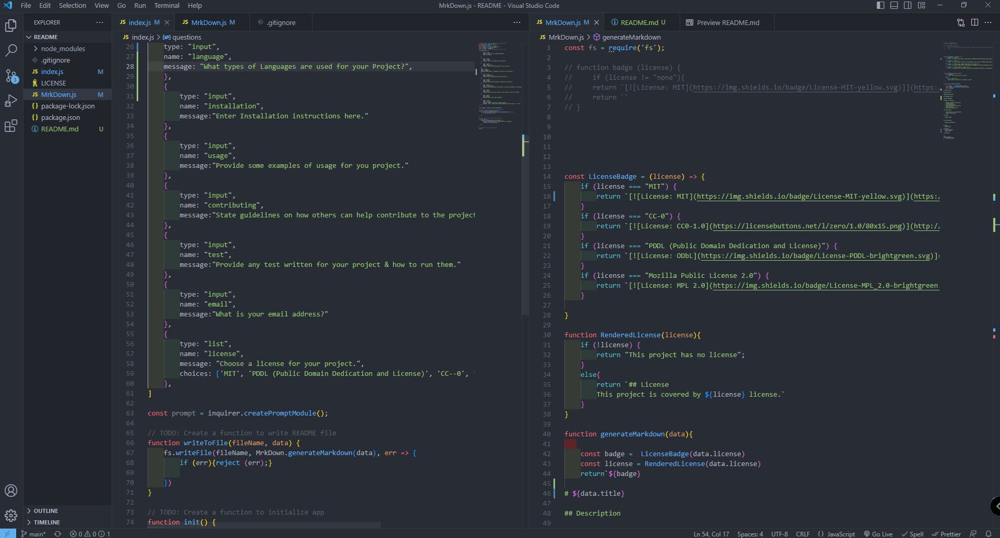

# ReadME Generator

## Description

Use this program to make ReadMes for your next project!

## Languages used

Java & NODE JS

## Table of Contents
  
  - [Installation](#installation)
  - [Usage](#usage)
  - [License](#license)
  - [Contributing](#contributing)
  - [Tests](#tests)
  - [Questions](#questions)

## Installation

    Instructions for installation:
    

## Usage

  This can be used to make READMES for all your Github REPOS!

## ScreenShot of Code
   
  

## Tests
  

## Contact 
  WyattOtto

  Wyattotto87@gmail.com

Link to Video:
https://drive.google.com/file/d/1ddpv5fe_iklwpEza346Tr5gq_DsDNL0U/view

 ## License 
        This project is covered by MIT license.

